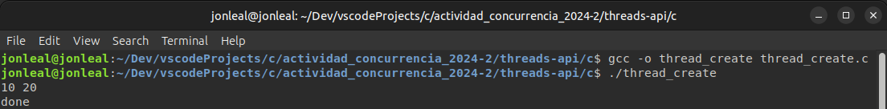
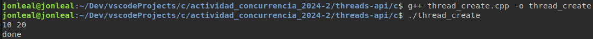
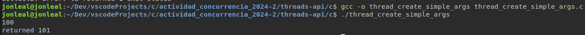
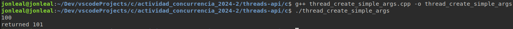
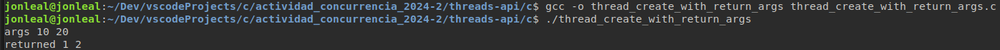
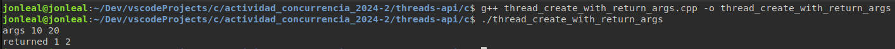

## El código c++ fue desarrollado por Juan Pablo Bedoya y Jonatan Leal 

# Implementación en C++

Los ejemplos que se implementaron son los que se encuentran en la sección [threads-api](../../threads-api/)

## Referencias principales

Coloque aqui las paginas donde encontro los ejemplos que mas le sirvieron para arrancar

## Ejemplos

Los códigos a reimplementar:
- [x] `thread_create.c`
- [x] `thread_create_simple_args.c`
- [x] `thread_create_with_return_args.c`

## Codigos

### Código `thread_create` 


**Codigo original**:
```c
#include <assert.h>
#include <stdio.h>
#include <pthread.h>

typedef struct {
    int a;
    int b;
} myarg_t;

void *mythread(void *arg) {
    myarg_t *args = (myarg_t *) arg;
    printf("%d %d\n", args->a, args->b);
    return NULL;
}

int main(int argc, char *argv[]) {
    pthread_t p;
    myarg_t args = { 10, 20 };

    int rc = pthread_create(&p, NULL, mythread, &args);
    assert(rc == 0);
    (void) pthread_join(p, NULL);
    printf("done\n");
    return 0;
}
```
**Codigo c++**:
```cpp
#include <cassert>
#include <iostream>
#include <pthread.h>

struct MyArg {
    int a;
    int b;
};

void* myThread(void* arg) {
    MyArg* args = static_cast<MyArg*>(arg);
    std::cout << args->a << " " << args->b << std::endl;
    return nullptr;
}

int main() {
    pthread_t p;
    MyArg args = { 10, 20 };

    int rc = pthread_create(&p, nullptr, myThread, &args);
    assert(rc == 0);
    pthread_join(p, nullptr);

    std::cout << "done" << std::endl;
    return 0;
}
```

## Ejecucion

#### Ejecucion

* **Ejecución del ejecutable generado del codigo C**:

    ```
    ./thread_create
    ```

    La salida se muestra a continuación:

    


* **Ejecución en c++**:

    ```
    ./thread_create
    ```

    La salida se muestra a continuación:

    

### Código `thread_create_simple_args` 


**Codigo original**:
```c
#include <stdio.h>
#include <pthread.h>
#include "common_threads.h"

void *mythread(void *arg) {
    long long int value = (long long int) arg;
    printf("%lld\n", value);
    return (void *) (value + 1);
}

int main(int argc, char *argv[]) {
    pthread_t p;
    long long int rvalue;
    Pthread_create(&p, NULL, mythread, (void *) 100);
    Pthread_join(p, (void **) &rvalue);
    printf("returned %lld\n", rvalue);
    return 0;
}
```
**Codigo c++**:
```cpp
#include <iostream>
#include <thread>
#include <future>

void myThread(std::promise<long long int> promise, long long int value) {
    std::cout << value << std::endl;
    promise.set_value(value + 1);
}

int main() {
    long long int rvalue;

    // Creamos un std::promise para pasar el resultado al hilo principal
    std::promise<long long int> promise;
    std::future<long long int> future = promise.get_future();

    // Creamos un hilo y le pasamos el valor inicial
    std::thread t(myThread, std::move(promise), 100);

    // Esperamos el resultado del hilo
    rvalue = future.get();
    t.join(); // Esperamos a que el hilo termine

    std::cout << "returned " << rvalue << std::endl;

    return 0;
}
```

## Ejecucion

#### Ejecucion

* **Ejecución del ejecutable generado del codigo C**:

    ```
    ./thread_create_simple_args
    ```

    La salida se muestra a continuación:

    


* **Ejecución en c++**:

    ```
    ./thread_create_simple_args
    ```

    La salida se muestra a continuación:

    


### Código `thread_create_with_return_args` 


**Codigo original**:
```c
#include <stdio.h>
#include <stdlib.h>
#include <pthread.h>
#include "common_threads.h"

typedef struct {
    int a;
    int b;
} myarg_t;

typedef struct {
    int x;
    int y;
} myret_t;

void *mythread(void *arg) {
    myarg_t *args = (myarg_t *) arg;
    printf("args %d %d\n", args->a, args->b);
    myret_t *rvals = malloc(sizeof(myret_t));
    assert(rvals != NULL);
    rvals->x = 1;
    rvals->y = 2;
    return (void *) rvals;
}

int main(int argc, char *argv[]) {
    pthread_t p;
    myret_t *rvals;
    myarg_t args = { 10, 20 };
    Pthread_create(&p, NULL, mythread, &args);
    Pthread_join(p, (void **) &rvals);
    printf("returned %d %d\n", rvals->x, rvals->y);
    free(rvals);
    return 0;
}
```
**Codigo c++**:
```cpp
#include <iostream>
#include <thread>
#include <memory>
#include <cassert>

struct MyArg {
    int a;
    int b;
};

struct MyRet {
    int x;
    int y;
};

void myThread(const MyArg& args, std::shared_ptr<MyRet> rvals) {
    std::cout << "args " << args.a << " " << args.b << std::endl;
    rvals->x = 1;
    rvals->y = 2;
}

int main() {
    MyArg args = {10, 20};
    auto rvals = std::make_shared<MyRet>();

    std::thread t(myThread, std::ref(args), rvals);

    t.join(); // Esperamos a que el hilo termine

    std::cout << "returned " << rvals->x << " " << rvals->y << std::endl;

    return 0;
}
```

## Ejecucion

#### Ejecucion

* **Ejecución del ejecutable generado del codigo C**:

    ```
    ./thread_create_with_return_args
    ```

    La salida se muestra a continuación:

    


* **Ejecución en c++**:

    ```
    ./thread_create_with_return_args
    ```

    La salida se muestra a continuación:

    

## Referencias

Coloque aqui referencias de utilidad.