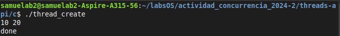
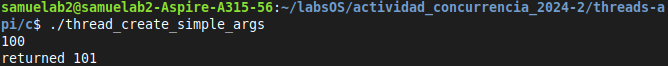
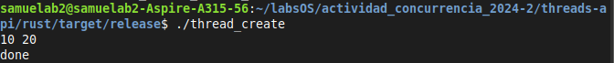
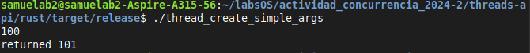
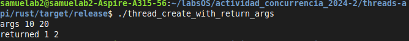

# Implementación en Rust

Los ejemplos que se implementaron son los que se encuentran en la sección [threads-api](../../threads-api/)

## Referencias principales

Rust book:

- **Using threads to run code simultaneously** [[link]](https://doc.rust-lang.org/book/ch16-01-threads.html)
- **Message passing between threads:** [[link]](https://doc.rust-lang.org/book/ch16-02-message-passing.html)

## Ejemplos

Los códigos a reimplementar:

- [x] `thread_create.c`
- [x] `thread_create_simple_args.c`
- [x] `thread_create_with_return_args.c`

## Codigos

Desarrollado por: **Samuel Acevedo**(samuel.acevedob@udea.edu.co)

### Codigo original: [thread_create.c](../c/thread_create.c)

```c
#include <assert.h>
#include <stdio.h>
#include <pthread.h>

typedef struct {
    int a;
    int b;
} myarg_t;

void *mythread(void *arg) {
    myarg_t *args = (myarg_t *) arg;
    printf("%d %d\n", args->a, args->b);
    return NULL;
}

int main(int argc, char *argv[]) {
    pthread_t p;
    myarg_t args = { 10, 20 };

    int rc = pthread_create(&p, NULL, mythread, &args);
    assert(rc == 0);
    (void) pthread_join(p, NULL);
    printf("done\n");
    return 0;
}
```

### Codigo implementado: [thread_create/main.rs](../rust/thread_create/src/main.rs)

```rust
use std::thread;

struct MyArgT {
    a: i32,
    b: i32,
}

fn mythread(args: MyArgT) {
    println!("{} {}", args.a, args.b);
    return;
}
fn main() {
    let args = MyArgT { a: 10, b: 20 };

    let handle = thread::spawn(|| {
        mythread(args);
    });

    handle.join().unwrap();
    println!("done");
}
```

<br>

### Codigo original: [thread_create_simple_args.c](../c/thread_create_simple_args.c)

```c
#include <stdio.h>
#include <pthread.h>
#include "common_threads.h"

void *mythread(void *arg) {
    long long int value = (long long int) arg;
    printf("%lld\n", value);
    return (void *) (value + 1);
}

int main(int argc, char *argv[]) {
    pthread_t p;
    long long int rvalue;
    Pthread_create(&p, NULL, mythread, (void *) 100);
    Pthread_join(p, (void **) &rvalue);
    printf("returned %lld\n", rvalue);
    return 0;
}
```

### Codigo implementado: [thread_create_simple_args/main.rs](../rust/thread_create_simple_args/src/main.rs)

```rust
use std::sync::mpsc;
use std::thread;

fn mythread(arg: i64) -> i64 {
    println!("{}", arg);
    return arg + 1;
}

fn main() {
    let (tx, rx) = mpsc::channel();
    let handle = thread::spawn(move || {
        let value = mythread(100);
        tx.send(value).unwrap();
    });
    handle.join().unwrap();
    let received = rx.recv().unwrap();
    println!("returned {received}");
}
```

<br>

### Codigo original: [thread_create_with_return_args.c](../c/thread_create_with_return_args.c)

```c
#include <stdio.h>
#include <stdlib.h>
#include <pthread.h>
#include "common_threads.h"

typedef struct {
    int a;
    int b;
} myarg_t;

typedef struct {
    int x;
    int y;
} myret_t;

void *mythread(void *arg) {
    myarg_t *args = (myarg_t *) arg;
    printf("args %d %d\n", args->a, args->b);
    myret_t *rvals = malloc(sizeof(myret_t));
    assert(rvals != NULL);
    rvals->x = 1;
    rvals->y = 2;
    return (void *) rvals;
}

int main(int argc, char *argv[]) {
    pthread_t p;
    myret_t *rvals;
    myarg_t args = { 10, 20 };
    Pthread_create(&p, NULL, mythread, &args);
    Pthread_join(p, (void **) &rvals);
    printf("returned %d %d\n", rvals->x, rvals->y);
    free(rvals);
    return 0;
}
```

### Codigo implementado: [thread_create_with_return_args/main.rs](../rust/thread_create_with_return_args/src/main.rs)

```rust
use std::sync::mpsc;
use std::thread;
struct ObjectFormat {
    a: i32,
    b: i32,
}

fn mythread(mut args: ObjectFormat) -> ObjectFormat {
    println!("args {} {}", args.a, args.b);
    args.a = 1;
    args.b = 2;
    return args;
}

fn main() {
    let args = ObjectFormat { a: 10, b: 20 };

    let (tx, rx) = mpsc::channel();

    let handle = thread::spawn(move || {
        let value = mythread(args);
        tx.send(value).unwrap();
    });

    handle.join().unwrap();
    let received = rx.recv().unwrap();
    println!("returned {} {}", received.a, received.b);
}
```

## Ejecucion

### Ejecución del ejecutable del código C

#### thread_create

- **Como llamar el ejecutable**:

  ```
  ./thread_create
  ```

- **Salida**:
  

#### thread_create_simple_args

- **Como llamar el ejecutable**:

  ```
  ./thread_create_simple_args
  ```

- **Salida**:
  

#### thread_create_with_return_args

- **Como llamar el ejecutable**:

  ```
  ./thread_create_with_return_args
  ```

- **Salida**:
  

### Ejecución del ejecutable del código Rust:

Los binarios son ejecutados desde la carpeta target/release/<br>
Si los quiere recrear basta con ejecutar el comando `cargo build --release`

#### thread_create

- **Como llamar el ejecutable**:

  ```
  ./thread_create
  ```

- **Salida**:
  

#### thread_create_simple_args

- **Como llamar el ejecutable**:

  ```
  ./thread_create_simple_args
  ```

- **Salida**:
  

#### thread_create

- **Como llamar el ejecutable**:

  ```
  ./thread_create_with_return_args
  ```

- **Salida**:
  

## Referencias

- **std thread documentation**: [[link]](https://doc.rust-lang.org/std/thread/index.html)
- **synchronization primitives**: [[link]](https://doc.rust-lang.org/std/sync/index.html)
