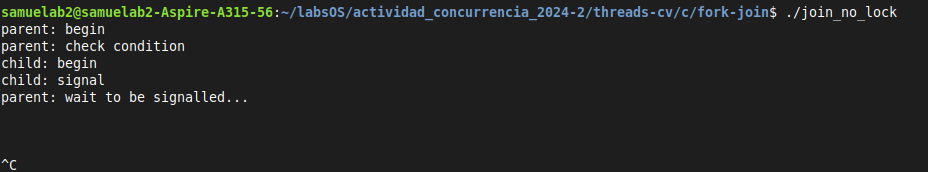
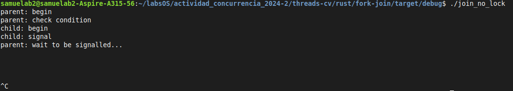

# Implementación en Rust

Los ejemplos que se implementaron son los que se encuentran en la sección [fork-join](../../../threads-cv/c/fork-join/)

## Referencias principales

- **Rust std reference(Mutex)**:https://doc.rust-lang.org/std/sync/struct.Mutex.html
- **Rust std reference(Condvar)**:https://doc.rust-lang.org/std/sync/struct.Condvar.html

## Ejemplos

Los códigos a reimplementar:

- [x] `join_spin.c`
- [x] `join_no_lock.c`
- [ ] `join_no_state_var.c`
- [ ] `join.c`
- [ ] `join_modular.c`

## Codigos

Coloque aqui los codigos en el lenguaje de su elección

### Código original: [join_spin.c](../../c/fork-join/join_spin.c)

```c
#include <stdio.h>
#include <unistd.h>
#include <pthread.h>
#include "common.h"
#include "common_threads.h"

volatile int done = 0;

void *child(void *arg) {
    printf("child\n");
    sleep(5);
    done = 1;
    return NULL;
}

int main(int argc, char *argv[]) {
    pthread_t p;
    printf("parent: begin\n");
    Pthread_create(&p, NULL, child, NULL);
    while (done == 0)
	; // spin
    printf("parent: end\n");
    return 0;
}
```

### Código implementado: [join_spin/main.rs](./join_spin/src/main.rs)

```rust
use std::{
    thread::{self, sleep},
    time,
};

static mut DONE: bool = false;

fn child() {
    println!("child");
    let time = time::Duration::from_secs(5);
    sleep(time);
    unsafe {
        DONE = true;
    }
}

fn main() {
    println!("parent: begin");

    thread::spawn(|| {
        child();
    });
    unsafe {
        while DONE == false {} //Spin
    }
    println!("parent: end");
}
```

### Código original: [join_no_lock](../../c/fork-join/join_no_lock.c)

```c
#include <stdio.h>
#include <unistd.h>
#include <pthread.h>
#include "common.h"
#include "common_threads.h"

pthread_cond_t  c = PTHREAD_COND_INITIALIZER;
pthread_mutex_t m = PTHREAD_MUTEX_INITIALIZER;
int done = 0;

void *child(void *arg) {
    printf("child: begin\n");
    sleep(1);
    done = 1;
    printf("child: signal\n");
    Cond_signal(&c);
    return NULL;
}
int main(int argc, char *argv[]) {
    pthread_t p;
    printf("parent: begin\n");
    Pthread_create(&p, NULL, child, NULL);
    Mutex_lock(&m);
    printf("parent: check condition\n");
    while (done == 0) {
	sleep(2);
	printf("parent: wait to be signalled...\n");
	Cond_wait(&c, &m);
    }
    Mutex_unlock(&m);
    printf("parent: end\n");
    return 0;
}
```

### Código implementado: [join_no_lock/main.rs](./join_no_lock/src/main.rs)

```rust
use std::sync::{Condvar, Mutex};
use std::thread::{self, sleep};
use std::time::Duration;

static mut DONE: bool = false;
static mut MUTEX: Mutex<bool> = Mutex::new(false);
static mut CVAR: Condvar = Condvar::new();

fn child() {
    println!("child: begin");
    sleep(Duration::from_secs(1));
    // Changes the value of the DONE condition variable and notifies.
    unsafe {
        DONE = true;
        println!("child: signal");
        // We notify the condvar that the value has changed.
        CVAR.notify_one();
    }
}
fn main() {
    println!("parent: begin");

    // Inside of our lock, spawn a new thread, and then wait for it to start.
    thread::spawn(|| child());
    unsafe {
        //Acquires the MUTEX lock
        let mut started = MUTEX.lock().unwrap();
        println!("parent: check condition");

        /* The problem that originates our deadlock occurs mainly because the child thread doesn't utilize the locks.
         * The execution flow makes the parent thread check the DONE condition(which at the moment is false), then sleeps.
         * Then the child thread is called, and it changes the DONE condition and notifies to wake up.
         * But the parent thread wasn't waiting on the condition yet. It was simply on sleep(Duration).
         * Then the parent thread executes normally and the call to wait sends it to sleep until CVAR notifies something.
         * There occurs our deadlock. CVAR has already notified, but at the wrong time. Ultimatelly our main thread remains waiting and our program is deadlocked.
         */
        //Checks the condition variable
        while DONE == false {
            sleep(Duration::from_secs(2));
            println!("parent: wait to be signalled...");
            // Orders the thread to wait. Doing that it releases the "started" MutexGuard
            started = CVAR.wait(started).unwrap();
        }
    }
    // Rust automatically unlocks when the Mutex gets out of scope
    println!("parent: end");
}

```

## Ejecución

Coloque las capturas de pantalla donde se evidencia el correcto funcionamiento de su código.

### Ejecución del ejecutable del código C

#### join_spin

- **Como llamar al ejecutable**:

  ```
  ./join_spin
  ```

- **Salida**:
  El ejecutable espera cinco segundos haciendo spin para pasar la CPU de vuelta al hilo padre. Esto significa que hay dos salidas, que representan ambos momentos en el tiempo.<br>
  
  <br><br>
  

#### join_no_lock

- **Como llamar al ejecutable**:

  ```
  ./join_no_lock
  ```

- **Salida**:
  

### Ejecución del ejecutable del código Rust

#### join_spin

- **Como llamar al ejecutable**:

  ```
  ./join_spin
  ```

- **Salida**:
  De la misma manera que su equivalente en C, el ejecutable tiene una pausa de 5 segundos entre hilo hijo y padre.<br>
  
  <br><br>
  

#### join_no_lock

- **Como llamar al ejecutable**:

  ```
  ./join_no_lock
  ```

- **Salida**:
  

## Referencias

Examples of how to create a deadlock: https://stackoverflow.com/questions/55958941/how-can-i-create-a-deadlock-with-rust
