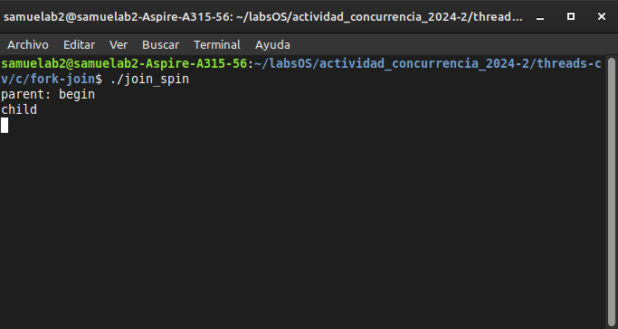
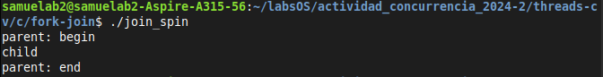
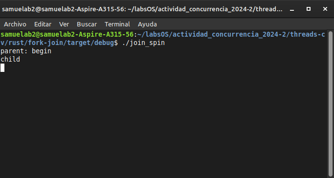

# Implementación en Rust

Los ejemplos que se implementaron son los que se encuentran en la sección [fork-join](../../../threads-cv/c/fork-join/)

## Referencias principales

Coloque aqui las paginas donde encontro los ejemplos que mas le sirvieron para arrancar

## Ejemplos

Los códigos a reimplementar:

- [x] `join_spin.c`
- [ ] `join_no_lock.c`
- [ ] `join_no_state_var.c`
- [ ] `join.c`
- [ ] `join_modular.c`

## Codigos

Coloque aqui los codigos en el lenguaje de su elección

### Código original: [join_spin.c](../../c/fork-join/join_spin.c)

```c
#include <stdio.h>
#include <unistd.h>
#include <pthread.h>
#include "common.h"
#include "common_threads.h"

volatile int done = 0;

void *child(void *arg) {
    printf("child\n");
    sleep(5);
    done = 1;
    return NULL;
}

int main(int argc, char *argv[]) {
    pthread_t p;
    printf("parent: begin\n");
    Pthread_create(&p, NULL, child, NULL);
    while (done == 0)
	; // spin
    printf("parent: end\n");
    return 0;
}
```

### Código implementado: [join_spin/main.rs](./join_spin/src/main.rs)

```rust
use std::{
    thread::{self, sleep},
    time,
};

static mut DONE: bool = false;

fn child() {
    println!("child");
    let time = time::Duration::from_secs(5);
    sleep(time);
    unsafe {
        DONE = true;
    }
}

fn main() {
    println!("parent: begin");

    thread::spawn(|| {
        child();
    });
    unsafe {
        while DONE == false {} //Spin
    }
    println!("parent: end");
}
```

## Ejecución

Coloque las capturas de pantalla donde se evidencia el correcto funcionamiento de su código.

### Ejecución del ejecutable del código C

#### join_spin

- **Como llamar al ejecutable**:

  ```
  ./join_spin
  ```

- **Salida**:
  El ejecutable espera cinco segundos haciendo spin para pasar la CPU de vuelta al hilo padre. Esto significa que hay dos salidas, que representan ambos momentos en el tiempo.<br>
  
  <br><br>
  

### Ejecución del ejecutable del código Rust

#### join_spin

- **Como llamar al ejecutable**:

  ```
  ./join_spin
  ```

- **Salida**:
  De la misma manera que su equivalente en C, el ejecutable tiene una pausa de 5 segundos entre hilo hijo y padre.<br>
  
  <br><br>
  

## Referencias

Coloque aqui referencias de utilidad.
