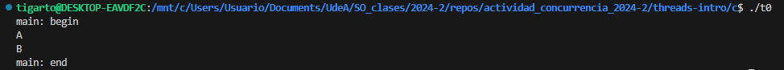
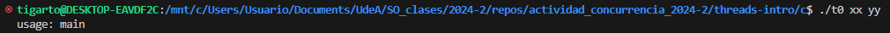
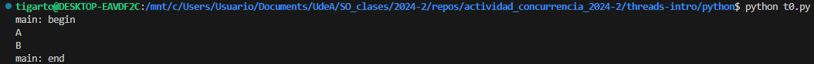
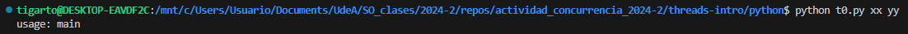

# Implementación en python 

Los ejemplos que se implementaron son los que se encuentran en la sección [threads-intro](../../threads-intro/)

Para la implementación se tomo como base los ejemplos de la siguiente paginas:
* **An Intro to Threading in Python** [[link]](https://realpython.com/intro-to-python-threading/)
* **Python Command-Line Arguments** [[link]](https://realpython.com/python-command-line-arguments/)

## Ejemplos

### Ejemplo 1

#### Codigos

* **Codigo original**: [t0.c](../c/t0.c)

  ```c
  #include <stdio.h>
  #include <stdlib.h>
  #include <pthread.h>

  #include "common.h"
  #include "common_threads.h"

  void *mythread(void *arg) {
    printf("%s\n", (char *)arg);
    return NULL;
  }

  int main(int argc, char *argv[]) {
    if (argc != 1) {
      fprintf(stderr, "usage: main\n");
      exit(1);
    }

    pthread_t p1, p2;
    printf("main: begin\n");
    Pthread_create(&p1, NULL, mythread, "A");
    Pthread_create(&p2, NULL, mythread, "B");
    // join waits for the threads to finish
    Pthread_join(p1, NULL);
    Pthread_join(p2, NULL);
    printf("main: end\n");
    return 0;
  }
  ```

* **Codigo implementado**: [t0.py](t0.py)

  Este codigo fue desarrollado por: Don Ramon (donramon@vecindad.com)
  
  ```py
  import threading
  import sys

  def mythread(arg):
    print(arg)
    
  if __name__ == "__main__":
    if len(sys.argv) != 1:
      print("usage: main\n")
    else:
      print("main: begin")
      # Creacion de los hilos
      p1 = threading.Thread(target=mythread, args=('A',))
      p2 = threading.Thread(target=mythread, args=('B',))
      # Se inicia la ejecucion de los hilos
      p1.start()
      p2.start()
      # El hilo padre espera que los hilos hijos culminen
      p1.join()
      p2.join()
      # Mensaje que se imprime despues de que el padre reinicia su ejecucion
      print("main: end")
  ```

#### Ejecucion

* **Ejecución del ejecutable generado del codigo C**:
  
  * **Caso 1**:

    ```
    ./t0
    ```

    La salida se muestra a continuación:

    

  * **Caso 2**:

    ```
    ./t0 xx yy 
    ```

    La salida se muestra a continuación:

    

* **Ejecución en python**:
  
  * **Caso 1**:

    ```
    python t0.py
    ```

    La salida se muestra a continuación:

    

  * **Caso 2**:

    ```
    python t0.py xx yy 
    ```

    La salida se muestra a continuación:

    


### Ejemplo 2

* **Codigo original**: [t1.c](../c/t1.c)

* **Codigo implementado**: To Do...

To Do...

## Referencias

* https://realpython.com/intro-to-python-threading/
* https://www.codecademy.com/resources/docs/python/threading
* https://realpython.com/python-concurrency/
* https://realpython.com/async-io-python/
* https://docs.python.org/es/3.8/library/threading.html
* https://fastapi.tiangolo.com/es/async/
* https://realpython.com/python-command-line-arguments/
* https://python-intermedio.readthedocs.io/es/latest/args_and_kwargs.html
