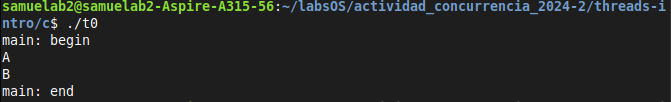
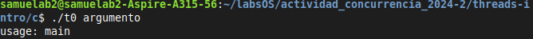
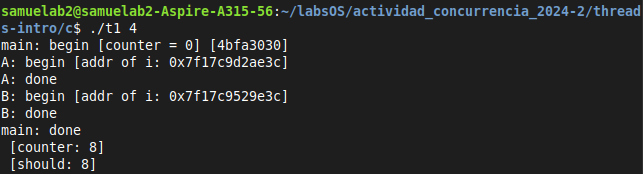
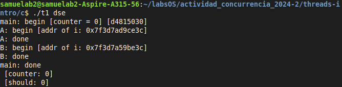
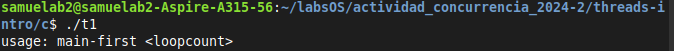
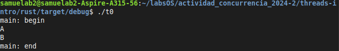
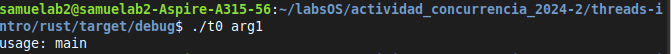
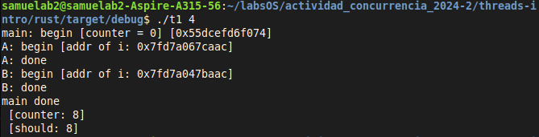
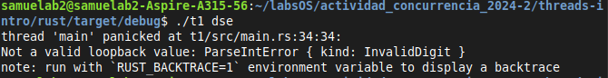
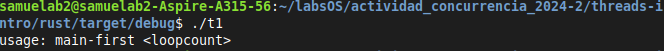

# Implementación en Rust

Los ejemplos que se implementaron son los que se encuentran en la sección [threads-intro](../../threads-intro/)

## Referencias principales

Rust book:

- **Using threads to run code simultaneously** [[link]](https://doc.rust-lang.org/book/ch16-01-threads.html)
- **Accessing or Modifying a Mutable Static Variable:** [[link]](https://doc.rust-lang.org/book/ch19-01-unsafe-rust.html?highlight=GLOBAL%20VARIABLES#accessing-or-modifying-a-mutable-static-variable)

## Ejemplos

Los códigos a reimplementar:

- [x] `t0.c`
- [x] `t1.c`

## Codigos

Desarrollado por: **Samuel Acevedo**(samuel.acevedob@udea.edu.co)

### Codigo original: [t0.c](../c/t0.c)

```c
#include <stdio.h>
#include <stdlib.h>
#include <pthread.h>

#include "common.h"
#include "common_threads.h"

void *mythread(void *arg) {
  printf("%s\n", (char *)arg);
  return NULL;
}

int main(int argc, char *argv[]) {
  if (argc != 1) {
    fprintf(stderr, "usage: main\n");
    exit(1);
  }

  pthread_t p1, p2;
  printf("main: begin\n");
  Pthread_create(&p1, NULL, mythread, "A");
  Pthread_create(&p2, NULL, mythread, "B");
  // join waits for the threads to finish
  Pthread_join(p1, NULL);
  Pthread_join(p2, NULL);
  printf("main: end\n");
  return 0;
}
```

### Codigo implementado: [t0/main.rs](../rust/t0/src/main.rs)

```rust
use std::env;
use std::process::exit;
use std::thread;

fn mythread(arg: &str) {
    println!("{}", arg);
}

fn main() {
    let args: Vec<String> = env::args().collect();
    let argc: usize = args.len();
    if argc != 1 {
        eprintln!("usage: main");
        exit(1);
    }

    println!("main: begin");

    let thread1handler = thread::spawn(|| {
        mythread("A");
    });

    let thread2handler = thread::spawn(|| {
        mythread("B");
    });

    thread1handler.join().unwrap();
    thread2handler.join().unwrap();
    println!("main: end");
}
```

<br>

### Codigo original: [t1.c](../c/t1.c)

```c
#include <stdio.h>
#include <stdlib.h>
#include <pthread.h>

#include "common.h"
#include "common_threads.h"

int max;
volatile int counter = 0; // shared global variable

void *mythread(void *arg) {
    char *letter = arg;
    int i; // stack (private per thread)
    printf("%s: begin [addr of i: %p]\n", letter, &i);
    for (i = 0; i < max; i++) {
	counter = counter + 1; // shared: only one
    }
    printf("%s: done\n", letter);
    return NULL;
}

int main(int argc, char *argv[]) {
    if (argc != 2) {
	fprintf(stderr, "usage: main-first <loopcount>\n");
	exit(1);
    }
    max = atoi(argv[1]);

    pthread_t p1, p2;
    printf("main: begin [counter = %d] [%x]\n", counter,
	   (unsigned int) &counter);
    Pthread_create(&p1, NULL, mythread, "A");
    Pthread_create(&p2, NULL, mythread, "B");
    // join waits for the threads to finish
    Pthread_join(p1, NULL);
    Pthread_join(p2, NULL);
    printf("main: done\n [counter: %d]\n [should: %d]\n",
	   counter, max*2);
    return 0;
}
```

### Codigo implementado: [t1/main.rs](../rust/t1/src/main.rs)

```rust
use std::env;
use std::process::exit;
use std::ptr::addr_of;
use std::thread;

static mut MAX: i32 = 1; // Hay que buscar como obtenerlo desde argv
static mut COUNTER: i32 = 0;

fn mythread(arg: &str) {
    let letter = arg;
    let mut i: i32 = 0;
    let i_address = &i;
    println!("{letter}: begin [addr of i: {:p}]", i_address);

    unsafe {
        while i < MAX {
            COUNTER = COUNTER + 1;
            i += 1;
        }
    }
    println!("{letter}: done");
}

fn main() {
    let args: Vec<String> = env::args().collect();
    let argc: usize = args.len();

    if argc != 2 {
        eprintln!("usage: main-first <loopcount>");
        exit(1);
    }

    unsafe {
        MAX = (&args[1]).parse().expect("Not a valid loopback value");

        let counter_address = addr_of!(COUNTER);
        println!("main: begin [counter = {COUNTER}] [{:p}]", counter_address);
    }

    let p1handler = thread::spawn(|| {
        mythread("A");
    });

    let p2handler = thread::spawn(|| {
        mythread("B");
    });

    p1handler.join().unwrap();
    p2handler.join().unwrap();
    unsafe {
        print!(
            "main done\n [counter: {}]\n [should: {}]\n",
            COUNTER,
            MAX * 2
        );
    }
}
```

## Ejecucion

### Ejecución del ejecutable del código C

#### t0

- **Como llamar el ejecutable**:

  ```
  ./t0
  ```

- **Salida**:
  

- **Ejecucion incorrecta**:

  ```
  ./t0 <argumento>
  ```

- **Salida**:
  

#### t1

- **Como llamar el ejecutable**:

  ```
  ./t1 <loopcount>
  ```

- **Salida**:
  

- **Ejecución incorrecta(el argumento loopcount no es un número)**:

  ```
  ./t1 <string>
  ```

- **Salida**:
  

- **Ejecución incorrecta(sin argumentos)**:

  ```
  ./t1
  ```

- **Salida**:
  

### Ejecución del ejecutable del código Rust:

Si quiere recrear los binarios basta con ejecutar el comando `cargo build`

#### t0

- **Como llamar el ejecutable**:

  ```
  ./t0
  ```

- **Salida**:
  

- **Ejecucion incorrecta**:

  ```
  ./t0 <argumento>
  ```

- **Salida**:
  

#### t1

- **Como llamar el ejecutable**:

  ```
  ./t1 <loopcount>
  ```

- **Salida**:
  

- **Ejecución incorrecta(el argumento loopcount no es un número)**:

  ```
  ./t1 <string>
  ```

- **Salida**:
  Como el lenguaje Rust es estricto con las definiciones de tipos de datos. Estas no pueden definirse sin inicializarlas con un valor por defecto y un tipo.

  Al correr el programa con un argumento diferente de un número el programa "panics" y termina su ejecución. Evitando comportamiento indefinido.

  

- **Ejecución incorrecta(sin argumentos)**:

  ```
  ./t1
  ```

- **Salida**:
  

## Referencias

- **std thread documentation**: [[link]](https://doc.rust-lang.org/std/thread/index.html)
- **Accepting command line arguments**: [[link]](https://doc.rust-lang.org/book/ch12-01-accepting-command-line-arguments.html)
- **Convert string to int in Rust**: [[link]](https://rustjobs.dev/blog/convert-string-to-int-in-rust/)
